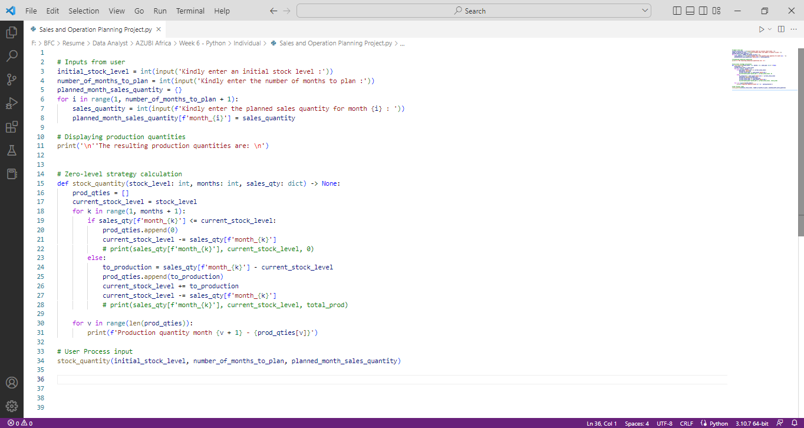
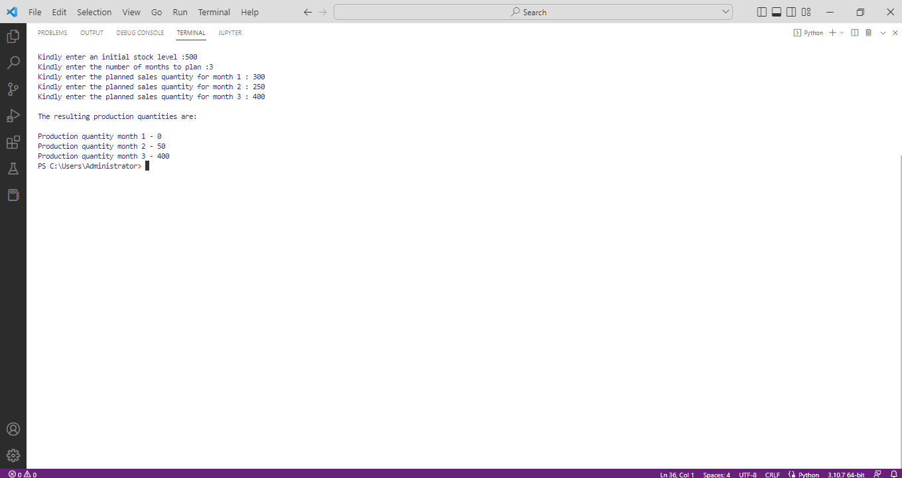

# Stock-Production-Planning

## Description
This project is to know the production quantity you need to replenish your monthly stock :relaxed::+1:

## :bulb:How It Works
:one: enter the initial stock.

:two: enter the number of month you want to plan for.

:three: enter the number of sales you expect to make for each month indicated in step 2.

The model will then indicate when you will be expected to start production and how much to produce with the current stock in mind.

## Screenshots:camera: of codes and results

&nbsp;

